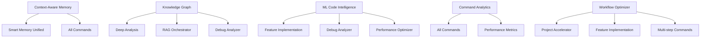

# ML MCP Implementation Roadmap
**Date**: 2025-01-09 10:25:00
**Timeline**: 4-week phased implementation

## 🎯 Implementation Priority Matrix

### Critical Path Dependencies


## 📅 Week 1: Foundation Layer

### Day 1-2: Context-Aware Memory MCP Integration
**Primary Target**: `/intelligence/smart_memory_unified_10x.md`

```markdown
Tasks:
1. [ ] Add context-memory MCP calls alongside existing memory operations
2. [ ] Implement intelligent classification logic using ML
3. [ ] Create fallback mechanisms for graceful degradation
4. [ ] Add performance monitoring and metrics collection
5. [ ] Test with various content types and scenarios

Integration Points:
- Replace manual classification rules with ML-based classification
- Add predictive retrieval based on context
- Implement relationship mapping to existing memories
- Enable pattern learning from usage

Success Metrics:
- 95% classification accuracy
- <100ms additional latency
- 80% improvement in retrieval relevance
```

### Day 3-4: Knowledge Graph MCP Foundation
**Primary Targets**: 
- `/deep_analysis_10x.md`
- `/rag_intelligence_orchestrator_10x.md`

```markdown
Tasks:
1. [ ] Implement knowledge graph initialization in deep_analysis
2. [ ] Add relationship mapping for analysis findings
3. [ ] Create graph queries for RAG orchestrator
4. [ ] Build visualization capabilities for relationships
5. [ ] Test graph construction and querying

Key Relationships to Map:
- Project components ↔ Technologies ↔ Patterns
- Errors ↔ Causes ↔ Solutions
- Features ↔ Dependencies ↔ Tests
- Market research ↔ Competitor analysis ↔ Opportunities

Success Metrics:
- Graph construction time <2s for average project
- Query response time <200ms
- 90% relationship accuracy
```

### Day 5: Command Analytics Base Infrastructure
**Target**: All command files

```markdown
Tasks:
1. [ ] Create analytics initialization template
2. [ ] Add tracking to top 5 most-used commands
3. [ ] Implement metrics storage in SQLite
4. [ ] Create basic analytics dashboard queries
5. [ ] Test data collection and storage

Metrics to Track:
- Command execution time
- Success/failure rates
- Resource usage
- Output quality indicators
- User interaction patterns

Implementation Pattern:
```yaml
# Add to each command's Phase 1:
command_analytics.start({
  command: "command_name",
  context: project_context,
  timestamp: now
})

# Add to final phase:
command_analytics.complete({
  command: "command_name",
  success: true/false,
  metrics: execution_metrics
})
```
```

## 📅 Week 2: Intelligence Layer

### Day 6-7: ML Code Intelligence Integration
**Primary Targets**:
- `/dev/implement_feature_10x.md`
- `/qa/intelligent_debug_analyzer_10x.md`

```markdown
Feature Implementation Enhancement:
1. [ ] Add real-time code suggestions during implementation
2. [ ] Implement pattern recognition for code quality
3. [ ] Add security vulnerability detection
4. [ ] Create performance optimization suggestions
5. [ ] Test with various coding scenarios

Debug Analyzer Enhancement:
1. [ ] Implement predictive error analysis
2. [ ] Add root cause probability calculation
3. [ ] Create fix suggestion ranking
4. [ ] Add prevention strategy recommendations
5. [ ] Test with historical error patterns

Success Metrics:
- 85% accuracy in error prediction
- 90% relevance in code suggestions
- 70% reduction in debugging time
```

### Day 8-9: Workflow Optimizer Initial Integration
**Primary Target**: `/project_accelerator_10x.md`

```markdown
Tasks:
1. [ ] Analyze current multi-phase workflow
2. [ ] Implement workflow optimization logic
3. [ ] Add parallel execution capabilities
4. [ ] Create adaptive workflow adjustments
5. [ ] Test optimization effectiveness

Optimization Targets:
- Research phase parallelization
- Intelligent task ordering
- Resource allocation optimization
- Bottleneck prediction and mitigation
- Dynamic workflow adaptation

Success Metrics:
- 40% reduction in total execution time
- 90% accuracy in bottleneck prediction
- 95% successful workflow completions
```

### Day 10: Integration Testing & Refinement
```markdown
1. [ ] End-to-end testing of integrated components
2. [ ] Performance profiling and optimization
3. [ ] Error handling and edge case testing
4. [ ] Documentation updates for new features
5. [ ] Team training on new capabilities
```

## 📅 Week 3: Advanced Integration

### Day 11-12: Knowledge Graph Advanced Features
**Targets**: All analysis and debugging commands

```markdown
Advanced Capabilities:
1. [ ] Multi-dimensional relationship mapping
2. [ ] Temporal evolution tracking
3. [ ] Pattern cluster identification
4. [ ] Predictive relationship discovery
5. [ ] Cross-project knowledge transfer

Integration Expansion:
- `/qa/test_strategy_10x.md` - Test relationship mapping
- `/learn_and_adapt_10x.md` - Learning pattern graphs
- `/local_command_generator_10x.md` - Command relationship mapping
```

### Day 13-14: ML Code Intelligence Expansion
**Targets**: All development commands

```markdown
Expanded Capabilities:
1. [ ] Code generation from specifications
2. [ ] Automated refactoring suggestions
3. [ ] Cross-language pattern recognition
4. [ ] Architecture recommendation engine
5. [ ] Technical debt identification

New Integrations:
- `/dev/optimize_performance_10x.md` - Performance pattern recognition
- `/docs/generate_docs_10x.md` - Intelligent documentation generation
- `/git/smart_commit_10x.md` - Commit message intelligence
```

### Day 15: Workflow Optimizer Expansion
**Targets**: All multi-step commands

```markdown
1. [ ] Expand to all complex workflows
2. [ ] Add team collaboration optimization
3. [ ] Implement resource constraint handling
4. [ ] Create workflow template learning
5. [ ] Add predictive workflow suggestions
```

## 📅 Week 4: Optimization & Polish

### Day 16-17: Performance Optimization
```markdown
Focus Areas:
1. [ ] Reduce ML MCP call latency
2. [ ] Implement intelligent caching
3. [ ] Optimize memory usage
4. [ ] Parallel processing where possible
5. [ ] Load balancing for ML services

Target Metrics:
- <100ms additional latency per ML call
- <10% memory overhead
- 95% cache hit rate for repeated operations
- 99.9% availability
```

### Day 18-19: User Experience Enhancement
```markdown
Improvements:
1. [ ] Add progress indicators for ML operations
2. [ ] Implement graceful degradation
3. [ ] Create intelligent error messages
4. [ ] Add ML confidence scores to outputs
5. [ ] Implement user preference learning

UI/UX Patterns:
- "🧠 ML analyzing patterns..." progress indicators
- Confidence scores: "87% confident in this suggestion"
- Fallback notices: "Using traditional analysis (ML temporarily unavailable)"
- Learning confirmations: "✓ Pattern learned for future use"
```

### Day 20: Production Readiness
```markdown
Final Checklist:
1. [ ] Complete integration testing
2. [ ] Performance benchmarking
3. [ ] Security audit for ML integrations
4. [ ] Documentation completion
5. [ ] Rollback procedures prepared
6. [ ] Monitoring dashboards ready
7. [ ] Team training completed
8. [ ] Success metrics tracking enabled
```

## 📊 Success Metrics & KPIs

### Week 1 Targets
- Context-Memory integration: 95% classification accuracy
- Knowledge Graph foundation: <2s construction time
- Command Analytics: Tracking top 5 commands

### Week 2 Targets
- ML Code Intelligence: 85% suggestion accuracy
- Workflow Optimizer: 40% time reduction
- Debugging enhancement: 70% faster resolution

### Week 3 Targets
- Full Knowledge Graph deployment: All analysis commands
- ML Code Intelligence expansion: All dev commands
- Workflow optimization: All multi-step commands

### Week 4 Targets
- Performance: <100ms ML overhead
- Availability: 99.9% uptime
- User satisfaction: >90% positive feedback

## 🚨 Risk Mitigation

### Technical Risks
1. **ML Service Latency**
   - Mitigation: Aggressive caching, async operations
   - Fallback: Traditional operation modes

2. **Memory/Resource Usage**
   - Mitigation: Resource limits, cleanup policies
   - Monitoring: Real-time resource tracking

3. **Integration Complexity**
   - Mitigation: Phased rollout, feature flags
   - Testing: Comprehensive integration tests

### Operational Risks
1. **Team Adoption**
   - Mitigation: Training, documentation, support
   - Measurement: Usage metrics, feedback loops

2. **Performance Degradation**
   - Mitigation: Performance budgets, monitoring
   - Response: Quick rollback procedures

## 🎯 Long-term Vision

### Month 2-3: Advanced Features
- Cross-project learning networks
- Predictive command suggestions
- Autonomous workflow optimization
- Team collaboration intelligence

### Month 4-6: Ecosystem Evolution
- Plugin architecture for custom ML MCPs
- Community-shared knowledge graphs
- Industry-specific optimizations
- AI pair programming capabilities

### Year 1: Full Intelligence Platform
- Self-improving command ecosystem
- Predictive development assistance
- Autonomous quality assurance
- Organizational knowledge OS

---
*This roadmap is a living document - update based on implementation progress and learnings*

🤖 Generated with [Claude Code](https://claude.ai/code)

Co-Authored-By: Claude <noreply@anthropic.com>