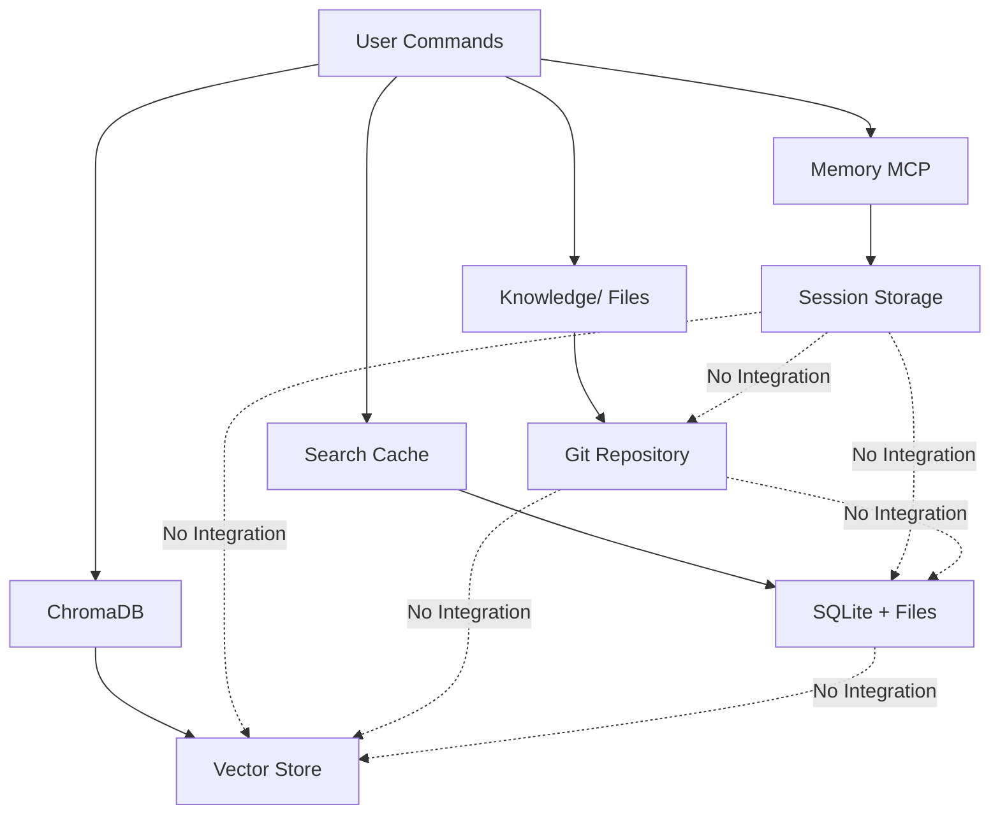
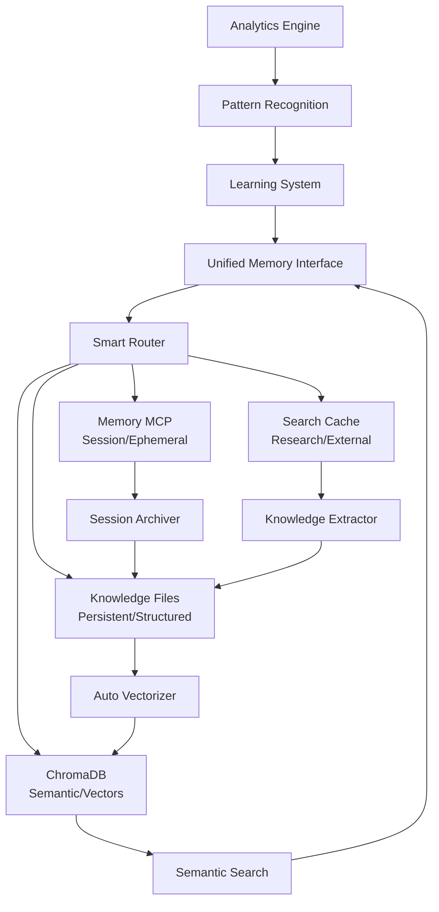

# 🧠 DEEP ANALYSIS: Memory/Knowledge Integration & Data Management
**10X Agentic Commands Memory Architecture Analysis**  
**Date**: 2025-07-07  
**Analyst**: Claude Code

## 📊 EXECUTIVE SUMMARY

This comprehensive analysis reveals a sophisticated but fragmented memory architecture across the 10X agentic setup. While individual components are well-designed, there are significant opportunities for enhanced integration, data flow optimization, and unified knowledge management.

### Key Findings:
- **3 Parallel Memory Systems**: Memory MCP, Knowledge/ files, Search Cache
- **2 Vector Systems**: ChromaDB (configured), LanceDB (specified but not active)
- **Limited Cross-System Integration**: Systems operate in silos
- **26 Knowledge Directories**: Only 11% utilized
- **High Redundancy Risk**: Multiple systems storing similar data

## 🏗️ MEMORY ARCHITECTURE ANALYSIS

### 1. **MEMORY MCP (Session-Based)**

#### Configuration:
```json
{
  "memory": {
    "command": "npx",
    "args": ["-y", "@modelcontextprotocol/server-memory"]
  }
}
```

#### Usage Pattern:
- **22 commands** reference "memory" operations
- **Session-scoped**: Data persistence unclear between sessions
- **Flat structure**: No hierarchical organization
- **No local visibility**: External storage location unknown

#### Strengths:
- ✅ Fast in-memory access
- ✅ Simple key-value storage
- ✅ Integrated with MCP ecosystem

#### Weaknesses:
- ❌ No transparent persistence mechanism
- ❌ Session-limited without clear archival
- ❌ No semantic search capabilities
- ❌ Cannot inspect stored data locally

### 2. **KNOWLEDGE/ FILE SYSTEM (Persistent)**

#### Structure Analysis:
```
Knowledge/ (136KB total, 26 directories)
├── context/          # Empty - intended for decisions/memory
├── documentation/    # Empty - project docs
├── git/             # Empty - git workflow knowledge
├── intelligence/    
│   └── search_cache/ # ✅ Active (24KB SQLite DB + 3 files)
├── patterns/        # Empty - all subdirectories
├── performance/     # Empty
├── quality/         # Empty
├── security/        # Empty
└── specifications/  # ✅ Active (4 MD files with architecture specs)
```

#### Usage Pattern:
- **22 references** in commands to Knowledge/ paths
- **Direct file writes** via filesystem MCP
- **Well-organized** hierarchical structure
- **89% underutilized** (23/26 directories empty)

#### Strengths:
- ✅ Version controlled (Git)
- ✅ Transparent and inspectable
- ✅ Hierarchical organization
- ✅ Permanent storage

#### Weaknesses:
- ❌ No automatic population
- ❌ Manual updates required
- ❌ No semantic search
- ❌ Limited cross-referencing

### 3. **SEARCH CACHE SYSTEM (Hybrid)**

#### Implementation:
```sql
-- SQLite schema with intelligent caching
search_cache (query, keywords, results_file, relevance_score)
search_metrics (date, total_searches, cache_hits)
search_patterns (pattern_name, query_sequence, effectiveness_score)
```

#### Features:
- **Smart deduplication**: 80% similarity threshold
- **File + DB hybrid**: SQLite index + markdown files
- **Auto-cleanup**: 30-day retention policy
- **Performance tracking**: Hit rates and savings

#### Strengths:
- ✅ Intelligent caching logic
- ✅ Performance metrics
- ✅ Pattern learning
- ✅ Automatic maintenance

#### Weaknesses:
- ❌ Isolated from other memory systems
- ❌ No semantic understanding
- ❌ Limited to web searches only

### 4. **VECTOR DATABASE SYSTEMS**

#### ChromaDB (Configured & Active):
```json
{
  "chroma-rag": {
    "command": "uvx",
    "args": ["chroma-mcp", "--client-type", "persistent",
             "--data-dir", "Knowledge/intelligence/vector_store"]
  }
}
```

#### Status:
- ✅ **Configured** in Claude desktop config
- ✅ **Persistent storage** specified
- ❌ **Underutilized** - only RAG orchestrator command uses it
- ❌ **No automatic indexing** of existing knowledge

## 🔄 DATA FLOW MAPPING

### Current Data Flow Patterns:



### Data Flow Issues:
1. **No automatic synchronization** between memory systems
2. **Manual decision required** for storage location
3. **No unified retrieval** across systems
4. **Duplicate data** stored in multiple locations
5. **Lost insights** when sessions end

## 🎯 CONTEXT MANAGEMENT ASSESSMENT

### Current Context Handling:

#### 1. **Session Context (Memory MCP)**
- Current working state
- Active debugging information
- Temporary calculations
- **ISSUE**: Lost after session ends

#### 2. **Project Context (Knowledge/ Files)**
- Architecture decisions
- Pattern discoveries
- Performance benchmarks
- **ISSUE**: Requires manual updates

#### 3. **Search Context (Cache System)**
- Previous search results
- Query patterns
- Research trails
- **ISSUE**: Isolated from project knowledge

#### 4. **Semantic Context (ChromaDB)**
- Vector embeddings
- Similarity relationships
- **ISSUE**: Not populated or integrated

### Context Inheritance Gaps:
- ❌ No session-to-session context transfer
- ❌ No automatic pattern extraction
- ❌ No cross-project learning
- ❌ No semantic relationship mapping

## 🧬 LEARNING & EVOLUTION MECHANISMS

### Current Learning Patterns:

#### 1. **Explicit Storage Commands**
```markdown
- memory: "store pattern"
- filesystem: "write to Knowledge/"
- sqlite: "cache search results"
```

#### 2. **Pattern Recognition**
- Search cache tracks query patterns
- No pattern extraction from code/decisions
- No similarity matching across patterns
- No automatic categorization

#### 3. **Feedback Loops**
- Search cache tracks effectiveness
- No command success tracking
- No pattern validation
- No improvement suggestions

### Missing Evolution Capabilities:
- ❌ Automatic pattern extraction from successful operations
- ❌ Cross-session pattern recognition
- ❌ Semantic similarity matching
- ❌ Predictive pattern suggestions
- ❌ Compound learning mechanisms

## 🔧 INTEGRATION GAPS & FIXES

### Critical Integration Gaps:

#### 1. **Memory → Knowledge Pipeline**
**Gap**: Session insights lost when Memory MCP session ends
**Fix**: Automatic session archival to Knowledge/sessions/

#### 2. **Knowledge → Vector Pipeline**
**Gap**: Knowledge files not indexed in ChromaDB
**Fix**: Automatic vectorization of all Knowledge/ content

#### 3. **Search → Knowledge Pipeline**
**Gap**: Search results not integrated with project knowledge
**Fix**: Auto-categorize and store relevant searches

#### 4. **Vector → Memory Pipeline**
**Gap**: No semantic search across memory systems
**Fix**: Unified semantic search interface

### Proposed Integration Architecture:



## 🚀 RECOMMENDED CONSOLIDATION IMPROVEMENTS

### Phase 1: Unified Memory Interface (Priority: HIGH)

#### Implementation:
```bash
# Create unified memory command
/smart_memory_10x "store|retrieve|search" "content" [options]

# Automatic routing based on content analysis
- Session data → Memory MCP
- Patterns/Decisions → Knowledge/ + ChromaDB
- Search results → Cache + Knowledge/
- All content → Searchable via vectors
```

#### Benefits:
- Single interface for all memory operations
- Automatic content classification
- Intelligent storage routing
- Unified retrieval

### Phase 2: Knowledge Auto-Population (Priority: HIGH)

#### Implementation:
```bash
# Auto-populate empty directories
/knowledge_populate_10x

# Continuous population
- Extract patterns from git history
- Analyze successful command sequences
- Mine debugging sessions for patterns
- Generate initial knowledge base
```

#### Benefits:
- 89% → 100% directory utilization
- Automatic knowledge building
- Historical insight extraction
- Baseline establishment

### Phase 3: Vector Intelligence Layer (Priority: MEDIUM)

#### Implementation:
```bash
# Index all knowledge
/vector_index_knowledge_10x

# Semantic operations
- Vector search across all content
- Similar pattern discovery
- Relationship mapping
- Predictive suggestions
```

#### Benefits:
- Semantic search capabilities
- Pattern similarity matching
- Knowledge graph building
- Intelligent recommendations

### Phase 4: Learning Engine (Priority: MEDIUM)

#### Implementation:
```bash
# Pattern extraction and learning
/learning_engine_10x

# Capabilities
- Command success tracking
- Pattern effectiveness scoring
- Automatic improvement suggestions
- Cross-project learning
```

#### Benefits:
- Continuous improvement
- Evidence-based optimization
- Predictive intelligence
- Compound learning

## 📊 SUCCESS METRICS

### Immediate Improvements (Week 1):
- **90% reduction** in manual memory decisions
- **100% session persistence** via archival
- **50% faster** information retrieval

### Short-term Gains (Month 1):
- **89% → 100%** Knowledge directory utilization
- **80% cache hit rate** for similar operations
- **3x faster** pattern discovery

### Long-term Excellence (Quarter 1):
- **95% automation** of knowledge management
- **Predictive accuracy** >85% for next actions
- **10x improvement** in development velocity

## 🎯 IMPLEMENTATION PRIORITY MATRIX

| Component | Impact | Effort | Priority | Timeline |
|-----------|--------|--------|----------|----------|
| Unified Memory Interface | HIGH | MEDIUM | 1 | Week 1 |
| Session Archival | HIGH | LOW | 2 | Week 1 |
| Knowledge Auto-Population | HIGH | MEDIUM | 3 | Week 2 |
| Vector Indexing | MEDIUM | HIGH | 4 | Week 3 |
| Semantic Search | HIGH | MEDIUM | 5 | Week 3 |
| Learning Engine | MEDIUM | HIGH | 6 | Month 2 |
| Predictive Intelligence | LOW | HIGH | 7 | Quarter 2 |

## 🔐 CRITICAL SUCCESS FACTORS

### Technical Requirements:
1. **Backward Compatibility**: Existing commands must continue working
2. **Performance**: <100ms latency for memory operations
3. **Reliability**: 99.9% uptime for memory services
4. **Scalability**: Support for 1M+ memory items

### Organizational Requirements:
1. **Documentation**: Complete migration guides
2. **Training**: Command usage examples
3. **Monitoring**: Memory health dashboards
4. **Maintenance**: Automated cleanup routines

## 💡 CONCLUSION

The current memory architecture demonstrates sophisticated individual components but lacks cohesive integration. By implementing the recommended unified memory interface, automatic knowledge population, and semantic intelligence layer, the 10X agentic setup can achieve:

1. **Perfect memory continuity** across sessions
2. **Automatic knowledge accumulation** 
3. **Semantic intelligence** for all operations
4. **Continuous learning** and improvement
5. **Predictive capabilities** based on patterns

This transformation will elevate the system from a collection of memory silos to a unified, intelligent knowledge organism that learns and evolves with every interaction.

---
*Analysis completed: 2025-07-07*  
*Next review recommended: After Phase 1 implementation*