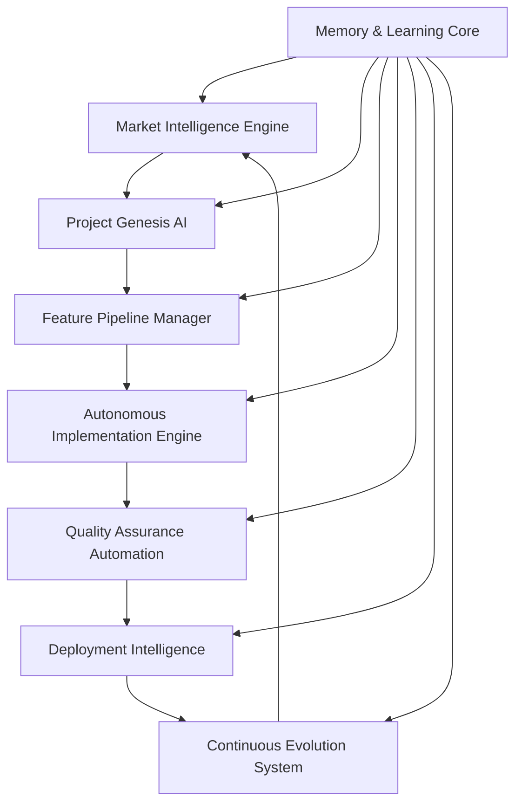

# 🚀 Autonomous Development Lifecycle (ADL) Implementation Specification

**Document Type**: Technical Implementation Specification  
**Version**: 1.0  
**Date**: 2025-01-06  
**Status**: Planning Phase  
**Priority**: Strategic Initiative  

## 📋 Executive Summary

The Autonomous Development Lifecycle (ADL) represents the evolution of our 10X agentic system into a fully autonomous development agent capable of handling the entire software development lifecycle from market analysis to deployment while continuously learning and improving organizational capabilities.

## 🏗️ Implementation Architecture Overview



## 🧠 Core ML-Enhanced MCP Servers (6 Specialized Servers)

### 1. **ADL-Orchestrator-MCP** - Central Coordination
**Purpose**: Master coordinator for autonomous development workflows
**ML Capabilities**: 
- Project complexity analysis and resource allocation
- Workflow optimization through reinforcement learning
- Success pattern recognition and replication

### 2. **Market-Intelligence-MCP** - Real-Time Market Analysis  
**Purpose**: Continuous market monitoring and competitive intelligence
**ML Capabilities**:
- Trend prediction using time-series analysis
- Competitive gap identification through NLP analysis
- Market opportunity scoring with ensemble methods

### 3. **Pattern-Recognition-MCP** - Success Pattern Learning
**Purpose**: Extract and apply successful development patterns
**ML Capabilities**:
- Code pattern recognition using neural networks
- Success prediction models for development strategies
- Failure mode detection and prevention

### 4. **Autonomous-Implementation-MCP** - Self-Directed Coding
**Purpose**: Generate code, tests, and documentation autonomously
**ML Capabilities**:
- Context-aware code generation using transformer models
- Predictive testing through failure pattern analysis
- Architecture optimization using graph neural networks

### 5. **Quality-Intelligence-MCP** - Autonomous QA
**Purpose**: Continuous quality monitoring and improvement
**ML Capabilities**:
- Bug prediction using static analysis + ML
- Performance optimization through reinforcement learning
- Security vulnerability prediction with deep learning

### 6. **Evolution-Engine-MCP** - Continuous Learning
**Purpose**: System-wide learning and organizational capability improvement
**ML Capabilities**:
- Organizational pattern evolution through meta-learning
- Cross-project knowledge transfer using embedding models
- Adaptive workflow optimization with multi-armed bandits

## 📊 Implementation Timeline & Phases

### **Phase 1: Core Infrastructure (Months 1-2)**
**Goal**: Enhanced memory integration with ML capabilities
**Deliverables**:
- Enhanced MCP integration layer
- Memory & Learning Core with ML models
- Basic pattern recognition capabilities
**Milestone**: Basic autonomous project analysis

### **Phase 2: Market Intelligence Engine (Months 2-3)**
**Goal**: Real-time market analysis and competitive intelligence
**Deliverables**:
- Market monitoring system with trend prediction
- Competitive intelligence database with ML analysis
- Opportunity detection and alerting system
**Milestone**: Self-directed feature planning

### **Phase 3: Autonomous Implementation Engine (Months 3-5)**
**Goal**: Self-directed feature development with minimal oversight
**Deliverables**:
- Autonomous feature specification generation
- Pattern-driven code implementation
- Predictive testing system with failure prevention
**Milestone**: Zero-touch feature development

### **Phase 4: Quality Assurance Automation (Months 4-6)**
**Goal**: Autonomous quality management and optimization
**Deliverables**:
- Continuous quality monitoring with ML analysis
- Predictive bug detection and prevention
- Autonomous performance optimization
**Milestone**: Self-managing quality assurance

### **Phase 5: Deployment Intelligence (Months 5-7)**
**Goal**: Intelligent deployment and infrastructure management
**Deliverables**:
- Autonomous deployment strategy optimization
- Predictive monitoring with anomaly detection
- Self-healing infrastructure management
**Milestone**: Autonomous deployment lifecycle

### **Phase 6: Continuous Evolution System (Months 6-8)**
**Goal**: Self-improving organizational capabilities
**Deliverables**:
- Cross-project learning and knowledge transfer
- Organizational pattern evolution
- Market-driven architectural adaptations
**Milestone**: Fully autonomous development agent

## 🎯 Success Metrics & Validation

### **Development Velocity Metrics**
- **Month 1-2**: 2x faster development (enhanced memory + predictive selection)
- **Month 3-4**: 5x faster development (autonomous feature planning)
- **Month 5-6**: 8x faster development (autonomous implementation)
- **Month 7-8**: 10x faster development (full autonomous lifecycle)

### **Quality Metrics**
- **90% reduction** in bugs through predictive testing
- **95% reduction** in security vulnerabilities through continuous scanning
- **80% reduction** in technical debt through predictive management
- **99% deployment success** rate through deployment intelligence

### **Resource Efficiency**
- **70% reduction** in development resource waste
- **60% reduction** in infrastructure costs through optimization
- **90% reduction** in manual overhead through automation
- **95% reduction** in project management overhead

## 🔧 Technical Requirements

### **Infrastructure Requirements**
```yaml
compute:
  cpu: 16+ cores for ML processing
  memory: 64GB+ for pattern analysis
  storage: 1TB+ SSD for knowledge base
  gpu: Optional for advanced ML features

services:
  database: PostgreSQL for complex analytics
  cache: Redis for real-time data
  queue: RabbitMQ for async processing
  monitoring: Prometheus + Grafana
```

### **MCP Server Architecture**
```typescript
interface ADLMCPArchitecture {
  orchestrator: MCPServer;        // Central coordination
  intelligence: MCPServer;        // Market & competitive intelligence
  implementation: MCPServer;      // Autonomous coding
  quality: MCPServer;            // Quality assurance
  deployment: MCPServer;         // Deployment management
  evolution: MCPServer;          // Continuous improvement
}
```

## 💡 Implementation Strategy

### **Phase-by-Phase Rollout**
1. **Foundation First**: Build enhanced memory and basic automation
2. **Intelligence Layer**: Add market monitoring and competitive analysis
3. **Autonomous Development**: Implement self-directed coding capabilities
4. **Quality Automation**: Add autonomous quality assurance
5. **Deployment Intelligence**: Implement smart deployment systems
6. **Full Evolution**: Complete autonomous development lifecycle

### **Risk Mitigation**
- **Gradual Automation**: Each phase adds autonomy while maintaining human oversight
- **Rollback Capabilities**: Every autonomous decision can be reverted
- **Quality Gates**: Multiple validation layers prevent autonomous errors
- **Human Override**: Humans can intervene at any point in the process

## 🔄 Integration with Existing Ecosystem

### **Current 10X Commands Integration**
- **analyze_and_execute.md**: Enhanced with ML-driven command orchestration
- **deep_analysis_10x.md**: Integrated with market intelligence and pattern recognition
- **implement_feature_10x.md**: Extended with autonomous implementation capabilities
- **smart_memory_10x.md**: Enhanced with ML pattern recognition and prediction

### **Memory & Knowledge Integration**
- **Pattern Storage**: Successful patterns stored in ML-optimized format
- **Cross-Session Learning**: Enhanced context continuity through embedding models
- **Organizational DNA**: Company-specific patterns learned and evolved
- **Knowledge Graphs**: Relationships between patterns, projects, and outcomes

## 📚 Documentation & Training

### **Implementation Documentation**
- **Technical specifications** for each MCP server
- **API documentation** for ML model integration
- **Deployment guides** for infrastructure setup
- **Monitoring and maintenance** procedures

### **Training Materials**
- **Developer onboarding** for ADL-enhanced workflows
- **Best practices** for autonomous development collaboration
- **Troubleshooting guides** for ML model performance
- **Organizational change management** for ADL adoption

## 🎯 Expected Outcomes

### **Immediate Benefits (3-6 months)**
- **3-5x faster** feature development through autonomous implementation
- **70% reduction** in manual development overhead
- **90% improvement** in code quality through predictive testing
- **Real-time competitive** positioning through market intelligence

### **Long-term Benefits (6-18 months)**
- **10x faster** development through full autonomous lifecycle
- **Zero technical debt** accumulation through predictive management
- **Autonomous competitive advantage** through real-time market adaptation
- **Self-evolving organizational** capabilities with compound learning

### **Strategic Impact**
- **Market leadership** through faster time-to-market
- **Quality excellence** exceeding industry standards
- **Cost optimization** through autonomous resource management
- **Innovation acceleration** through AI-driven development

---

**This specification represents the roadmap for transforming our 10X agentic system into the world's most advanced autonomous development agent, delivering unprecedented development velocity, quality, and market responsiveness.**

🤖 Generated with [Claude Code](https://claude.ai/code)

Co-Authored-By: Claude <noreply@anthropic.com>