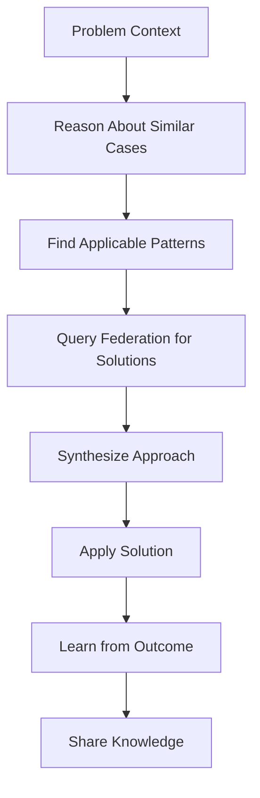
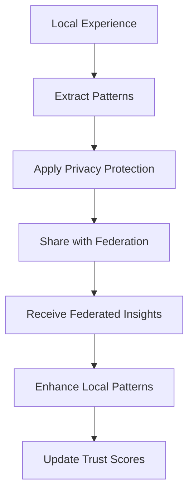
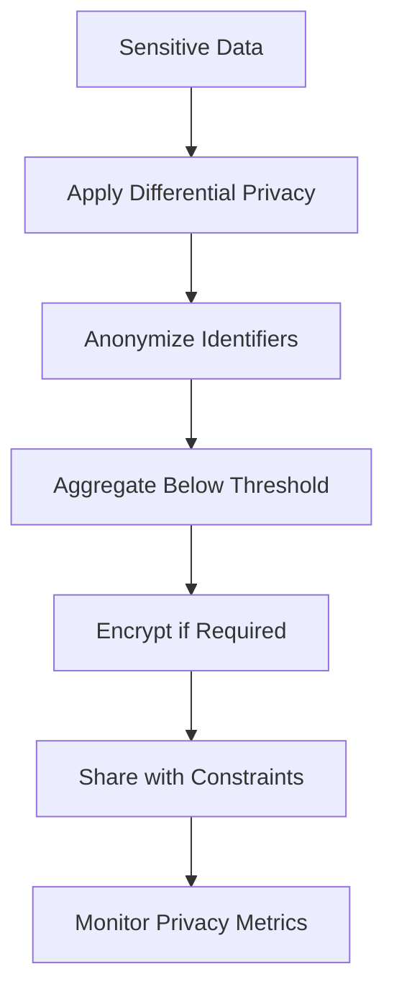

# Enhanced Context-Aware Memory MCP Server

## 🚀 Overview

The Enhanced Context-Aware Memory MCP Server represents a significant advancement in intelligent memory management, integrating cutting-edge capabilities for chain-of-thought reasoning, few-shot learning, and federated memory sharing. This system transforms traditional memory storage into an intelligent, collaborative knowledge network that learns, reasons, and shares insights across projects and organizations.

## ✨ Enhanced Features

### 🧠 Chain-of-Thought Memory Reasoning
- **Complex Pattern Recognition**: Multi-step reasoning process that identifies intricate patterns in memory data
- **Causal Inference**: Analyzes cause-effect relationships between memories and events
- **Temporal Reasoning**: Understands time-based patterns and sequences
- **Contextual Linking**: Discovers connections between seemingly unrelated memories
- **Predictive Reasoning**: Forecasts future outcomes based on historical patterns
- **Analogical Reasoning**: Finds analogous situations and transfers applicable insights

### 📚 Few-Shot Learning Memory Patterns
- **Pattern Extraction**: Automatically learns reusable patterns from small example sets
- **Success Pattern Reuse**: Captures and applies successful approaches to new situations
- **Adaptive Learning**: Continuously improves pattern effectiveness based on real-world feedback
- **Pattern Discovery**: Automatically discovers patterns from existing memory data
- **Confidence Scoring**: Provides reliability assessments for learned patterns
- **Multiple Pattern Types**: Supports success, failure, workflow, solution, optimization, and creative patterns

### 🌐 Federated Memory Network
- **Cross-Project Learning**: Shares knowledge across different projects and teams
- **Differential Privacy**: Advanced privacy protection using noise injection and anonymization
- **Secure Knowledge Sharing**: Encrypted sharing with integrity verification
- **Trust Management**: Dynamic trust scoring and reputation system for federation nodes
- **Privacy-Preserving Aggregation**: Combines insights while protecting sensitive information
- **Flexible Sharing Policies**: Granular control over what, how, and with whom knowledge is shared

## 🛠️ New MCP Tools

### Chain-of-Thought Reasoning Tools

#### `reason_about_memories`
Performs sophisticated multi-step reasoning on memory collections.

```typescript
interface ReasoningRequest {
  query_text: string;           // Question or analysis goal
  context: Record<string, any>; // Current context
  reasoning_types: string[];    // Types of reasoning to apply
  max_steps: number;           // Maximum reasoning steps
}
```

**Reasoning Types:**
- `pattern_analysis`: Identify recurring patterns and themes
- `causal_inference`: Find cause-effect relationships
- `temporal_reasoning`: Analyze time-based patterns
- `contextual_linking`: Discover contextual connections
- `predictive_reasoning`: Generate future predictions
- `analogical_reasoning`: Find analogous situations

**Example Usage:**
```json
{
  "query_text": "Analyze project success patterns",
  "context": {"domain": "software_development"},
  "reasoning_types": ["pattern_analysis", "causal_inference"],
  "max_steps": 5
}
```

### Few-Shot Learning Tools

#### `learn_from_examples`
Learns reusable patterns from example sets.

```typescript
interface LearningRequest {
  examples: Array<{
    context: Record<string, any>;
    input_features: Record<string, any>;
    output_features: Record<string, any>;
    outcome: string;
    success_score: number;
    metadata?: Record<string, any>;
  }>;
  pattern_type: string; // success_pattern, workflow_pattern, etc.
}
```

#### `find_similar_patterns`
Finds learned patterns applicable to current context.

```typescript
interface PatternQuery {
  context: Record<string, any>;
  input_features: Record<string, any>;
  desired_outcome: string;
  max_patterns: number;
}
```

#### `discover_memory_patterns`
Automatically discovers patterns from existing memories.

```typescript
interface DiscoveryRequest {
  min_examples: number;
  pattern_types: string[];
}
```

### Federated Memory Tools

#### `share_knowledge`
Shares knowledge with the federated network while preserving privacy.

```typescript
interface SharingRequest {
  knowledge_type: string;
  content: Record<string, any>;
  privacy_level: string;  // public, low, medium, high, private
  sharing_scope: string;  // global, organization, team, project_group, none
}
```

#### `query_federation`
Queries the federated network for relevant knowledge.

```typescript
interface FederationQuery {
  knowledge_types: string[];
  context: Record<string, any>;
  max_results: number;
}
```

### Enhanced Statistics Tool

#### `get_enhanced_memory_stats`
Provides comprehensive statistics across all enhanced capabilities.

Returns detailed metrics including:
- Chain-of-thought reasoning statistics
- Few-shot learning performance
- Federation activity and trust metrics
- Privacy protection statistics

## 🔧 Configuration

### Enhanced Server Configuration

```yaml
# Enhanced memory configuration
enhanced_memory:
  # Chain-of-thought reasoning
  reasoning:
    max_steps_default: 10
    confidence_threshold: 0.6
    cache_ttl: 300
  
  # Few-shot learning
  learning:
    min_examples: 3
    pattern_cache_size: 1000
    effectiveness_decay: 0.1
  
  # Federated memory
  federation:
    node_id: "unique_node_identifier"
    node_name: "Human Readable Node Name"
    organization: "Organization Name"
    private_key: "secure_private_key"
    
    # Privacy settings
    default_privacy_level: "medium"
    default_sharing_scope: "organization"
    differential_privacy:
      epsilon: 1.0
      delta: 1e-5
    
    # Trust management
    initial_trust: 0.5
    trust_decay: 0.05
    reputation_weight: 0.3
```

### Privacy Policies

Configure granular privacy policies for different content types:

```python
privacy_policies = {
    'user_data': PrivacyPolicy(
        privacy_level=PrivacyLevel.HIGH,
        sharing_scope=SharingScope.NONE,
        content_filters=['email', 'username', 'ip_address']
    ),
    'code_patterns': PrivacyPolicy(
        privacy_level=PrivacyLevel.MEDIUM,
        sharing_scope=SharingScope.ORGANIZATION,
        min_aggregation_count=5
    ),
    'public_insights': PrivacyPolicy(
        privacy_level=PrivacyLevel.LOW,
        sharing_scope=SharingScope.GLOBAL,
        max_sharing_frequency=10
    )
}
```

## 📊 Advanced Workflows

### 1. Intelligent Problem Solving Workflow



### 2. Collaborative Learning Workflow



### 3. Privacy-Preserving Analytics



## 🎯 Use Cases

### Software Development Teams
- **Pattern Recognition**: Identify successful development patterns across projects
- **Bug Resolution**: Learn from past bug fixes and apply similar solutions
- **Code Review Insights**: Share best practices while protecting proprietary code
- **Performance Optimization**: Federated learning of optimization strategies

### Research Organizations
- **Knowledge Synthesis**: Combine insights from multiple research projects
- **Methodology Sharing**: Share research methodologies while protecting sensitive data
- **Collaborative Discovery**: Discover patterns across distributed research teams
- **Privacy-Compliant Sharing**: Share insights while meeting regulatory requirements

### Customer Support
- **Solution Patterns**: Learn effective solution patterns from support interactions
- **Escalation Prediction**: Predict likely escalation scenarios
- **Knowledge Federation**: Share anonymized solution patterns across teams
- **Continuous Improvement**: Learn from federated support experiences

### Educational Institutions
- **Learning Pattern Analysis**: Understand what teaching methods work best
- **Student Success Patterns**: Identify patterns leading to student success
- **Resource Optimization**: Share educational resource effectiveness data
- **Privacy-Protected Analytics**: Analyze learning patterns while protecting student privacy

## 🔒 Privacy and Security

### Privacy Levels

1. **PUBLIC**: No privacy protection - suitable for general knowledge
2. **LOW**: Basic anonymization - removes direct identifiers
3. **MEDIUM**: Differential privacy with moderate noise - balances utility and privacy
4. **HIGH**: Strong differential privacy with significant noise - maximum protection
5. **PRIVATE**: No sharing - local only

### Security Features

- **End-to-End Encryption**: All high-sensitivity communications encrypted
- **Digital Signatures**: Integrity verification for shared knowledge
- **Trust Scoring**: Dynamic trust assessment of federation participants
- **Access Control**: Granular permissions based on organizational boundaries
- **Audit Logging**: Comprehensive logging of all sharing activities

### Compliance

The system supports various compliance requirements:
- **GDPR**: Privacy-by-design with anonymization and consent management
- **HIPAA**: Healthcare data protection with strong encryption and access controls
- **SOX**: Financial data protection with audit trails and access logging
- **Custom Policies**: Flexible policy framework for organization-specific requirements

## 📈 Performance Metrics

### Reasoning Performance
- **Chain Completion Rate**: Percentage of reasoning chains successfully completed
- **Average Confidence**: Mean confidence score across reasoning steps
- **Pattern Discovery Rate**: Number of new patterns discovered per reasoning session
- **Insight Quality**: Effectiveness of generated insights based on user feedback

### Learning Performance
- **Pattern Success Rate**: Effectiveness of learned patterns in new situations
- **Learning Velocity**: Speed of pattern acquisition and refinement
- **Pattern Reuse**: Frequency of successful pattern application
- **Adaptation Efficiency**: How quickly patterns improve with feedback

### Federation Performance
- **Knowledge Sharing Volume**: Amount of knowledge shared and received
- **Privacy Protection Effectiveness**: Success rate of privacy preservation
- **Trust Network Health**: Overall trust scores and network connectivity
- **Cross-Project Value**: Measurable benefit from federated learning

## 🚦 Getting Started

### 1. Installation

```bash
# Install dependencies
pip install -r requirements.txt

# Install privacy protection libraries
pip install cryptography differential-privacy
```

### 2. Configuration

```bash
# Create configuration
cp config/memory_config.example.yaml config/memory_config.yaml

# Edit configuration with your settings
vim config/memory_config.yaml
```

### 3. Initialization

```python
from server import ContextAwareMemoryServer
from utils.config_utils import ConfigManager

# Load configuration
config_manager = ConfigManager()
config = config_manager.load_config("context-aware-memory")

# Start enhanced server
server = ContextAwareMemoryServer(config)
server.run(transport="stdio")
```

### 4. Basic Usage

```python
# Chain-of-thought reasoning
reasoning_result = await server.reason_about_memories(
    query_text="Analyze successful project patterns",
    context={"domain": "web_development"},
    reasoning_types=["pattern_analysis", "predictive_reasoning"]
)

# Learn from examples
pattern_result = await server.learn_from_examples(
    examples=success_examples,
    pattern_type="success_pattern"
)

# Share knowledge
sharing_result = await server.share_knowledge(
    knowledge_type="development_pattern",
    content=extracted_patterns,
    privacy_level="medium",
    sharing_scope="organization"
)
```

## 🧪 Testing

### Run Test Suite

```bash
# Run all tests
pytest tests/

# Run specific capability tests
pytest tests/test_cot_reasoning.py
pytest tests/test_few_shot_learning.py
pytest tests/test_federated_memory.py

# Run integration tests
pytest tests/test_enhanced_integration.py

# Run with coverage
pytest --cov=src tests/
```

### Test Categories

- **Unit Tests**: Individual component functionality
- **Integration Tests**: Cross-component interactions
- **Privacy Tests**: Privacy protection verification
- **Performance Tests**: Scalability and efficiency
- **Security Tests**: Security feature validation

## 📝 API Reference

Comprehensive API documentation is available in the `/docs` directory:

- **Chain-of-Thought API**: Detailed reasoning tool documentation
- **Few-Shot Learning API**: Pattern learning and application reference
- **Federated Memory API**: Federation and privacy management guide
- **Configuration Reference**: Complete configuration options
- **Privacy Framework**: Privacy policy and protection mechanisms

## 🤝 Contributing

We welcome contributions to enhance the memory capabilities:

1. **Feature Development**: Implement new reasoning types or learning algorithms
2. **Privacy Enhancements**: Improve privacy protection mechanisms
3. **Performance Optimization**: Optimize for scale and efficiency
4. **Documentation**: Improve guides and API documentation
5. **Testing**: Add comprehensive test coverage

### Development Setup

```bash
# Clone repository
git clone <repository-url>
cd context_aware_memory

# Create development environment
python -m venv venv
source venv/bin/activate

# Install development dependencies
pip install -r requirements-dev.txt

# Run pre-commit hooks
pre-commit install
```

## 🔮 Future Enhancements

### Planned Features

1. **Advanced Reasoning Types**
   - Deductive reasoning chains
   - Inductive pattern generalization
   - Abductive hypothesis generation

2. **Enhanced Learning Algorithms**
   - Meta-learning for rapid adaptation
   - Multi-task learning across domains
   - Active learning for selective data collection

3. **Federation Improvements**
   - Blockchain-based trust verification
   - Homomorphic encryption for computation on encrypted data
   - Federated neural network training

4. **Performance Optimizations**
   - Distributed processing across federation nodes
   - GPU acceleration for pattern recognition
   - Real-time streaming analytics

### Research Directions

- **Explainable AI**: Making reasoning chains more interpretable
- **Quantum Privacy**: Quantum-resistant privacy protection
- **Semantic Reasoning**: Integration with knowledge graphs
- **Temporal Dynamics**: Understanding how patterns evolve over time

## 📜 License

This enhanced memory system is licensed under [MIT License](LICENSE). The privacy protection components include additional protections under applicable data protection regulations.

## 🆘 Support

For support and questions:

- **Documentation**: Check the comprehensive guides in `/docs`
- **Issues**: Report bugs and feature requests on GitHub
- **Discussions**: Join community discussions for best practices
- **Security**: Report security issues privately to security@yourorg.com

## 🙏 Acknowledgments

This enhanced memory system builds upon:

- **Differential Privacy Research**: Privacy protection methodologies
- **Few-Shot Learning Literature**: Pattern learning and transfer techniques
- **Federated Learning Frameworks**: Distributed learning approaches
- **Memory Research**: Human memory and cognitive science insights

---

**Transform your memory management into an intelligent, collaborative knowledge network that learns, reasons, and grows with your organization while protecting privacy and ensuring security.**